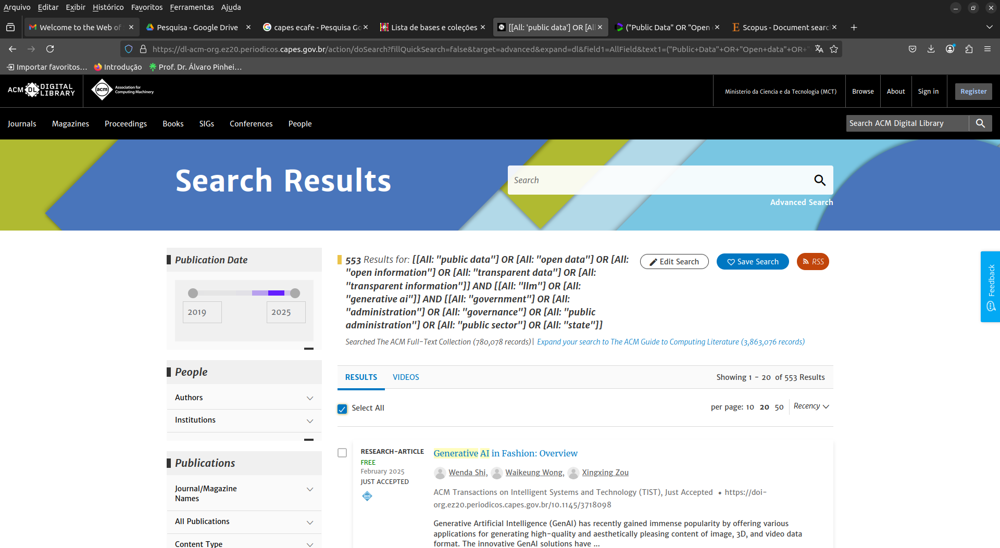
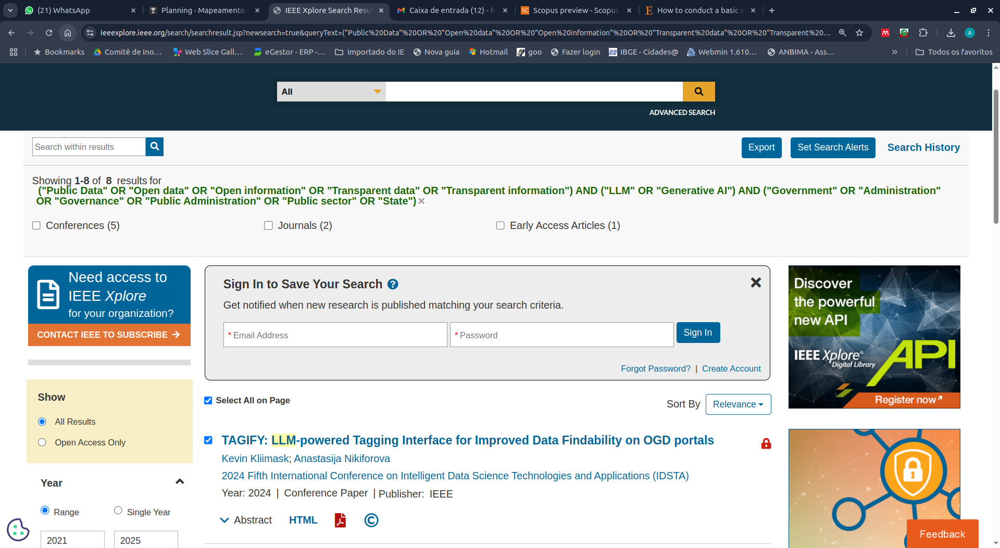
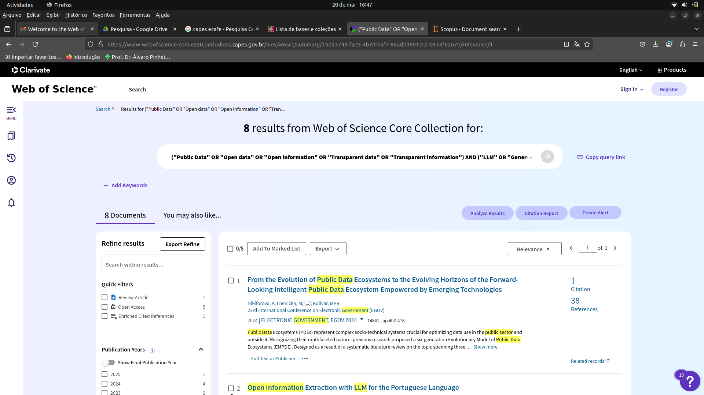
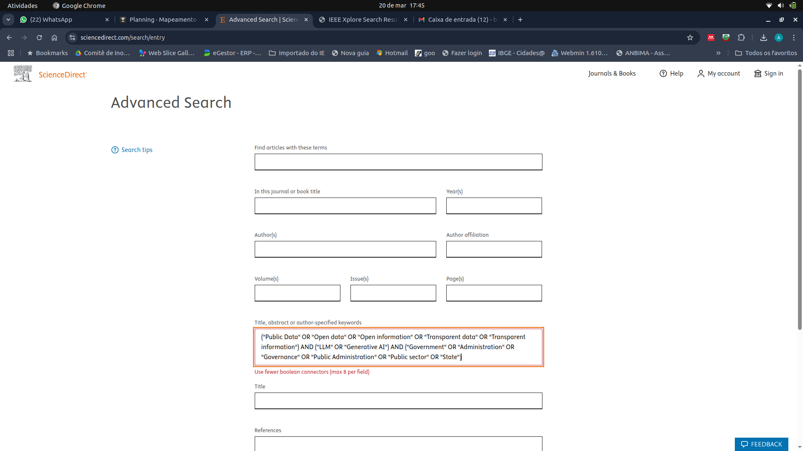
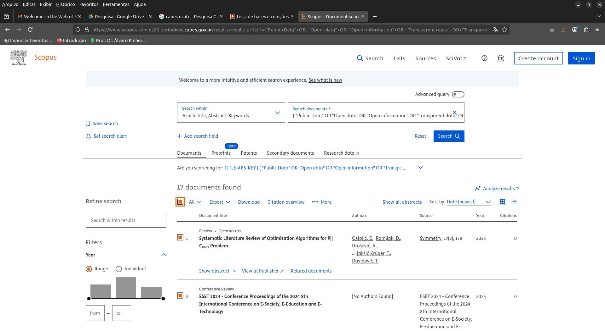
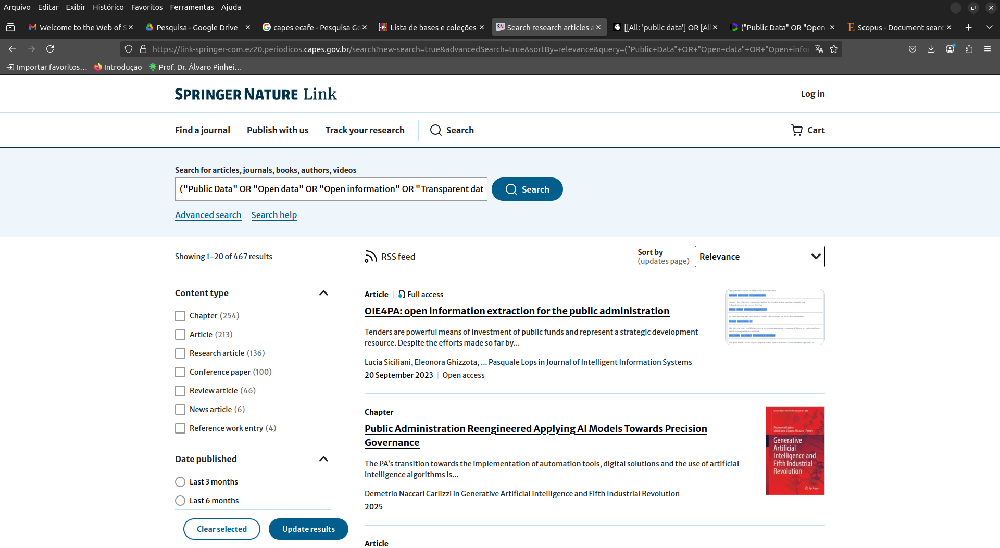

```{r setup, include=FALSE}
knitr::opts_chunk$set(echo = FALSE)

```

\section{Objetivo}

Analisar os padrões de adoção e utilização de Large Language Models (LLMs) por pesquisadores no contexto da análise de dados abertos governamentais, caracterizando suas percepções sobre benefícios, limitações e implicações metodológicas.

---

\section{Protocolo - PICOC}
- **Population**: Public Data
- **Intervention**: LLM
- **Comparison**: 
- **Outcome**: Government
- **Context**: 

---

\section{Palavras-Chaves e sinônimos}
\include{tabelas/key_words}
---

\section{String de Busca}

---

\include{tabelas/string}

---

\subsection{String de busca Science Direct}

---

\include{tabelas/string_science_direct}

---

\section{Fontes}
- [ACM Digital Library](http://portal.acm.org)
- [IEEE Digital Library](http://ieeexplore.ieee.org)
- [ISI Web of Science](http://www.isiknowledge.com)
- [Science@Direct](http://www.sciencedirect.com)
- [Scopus](http://www.scopus.com)
- [Springer Link](http://link.springer.com)


---

\section{Criterios de seleção}

---

\subsection{Critérios de inclusão}

1. CI01 - Artigo tem que responder parcialmente ao menos uma questao de pesquisa.

1. CI02 - Artigo tem que tratar sobre dados governamentais abertos e LLM.

---

\subsection{Critérios de exclusão}

1. CE01 - Artigos duplicados
1. CE02 - Artigos não escritos em inglês
1. CE03 - Artigos publicados somente como abstract
1. CE04 - Artigos que não foram publicados em conferência ou journal
1. CE05 - Artigos que não tratam de dados governamentais
1. CE06 - Artigos que não tratam sobre LLM
1. CE07 - Estudos Secundarios e Terciarias


---

\section{Condução}

---



---



---



---



---



---



---


\subsection{Estudos importados}

---

\include{tabelas/qtde_artigos}

---

\section{Questões de pesquisa}

---

\subsection{RQ1 - Qual foi o tipo de resultado obtido?}
\begin{itemize}
\item Analytic model
\item Empirical model
\item Procedure or technique
\item Qualitative or descriptive model
\item Report
\item Specific solution, prototype, answer, or judgment
\item Tool or notation
\end{itemize}


---

\subsection{RQ2 - Qual o tipo de validação do artigo?}
\begin{itemize}
\item Analysis
\item Blatant assertion
\item Evaluation
\item Example
\item Experience
\item Persuasion
\end{itemize}

---

\subsection{RQ3 - Qual campo governamental a pesquisa foi feita?}
\begin{itemize}
\item Educação
\item Justiça
\item Saude
\item Segurança
\item Transporte
\item Outros
\end{itemize}
---

\subsection{RQ4 - Qual modelo e versão de LLM foi utilizado?}

---

\subsection{RQ5 - Qual a função da LLM no artigo?}

---

\subsection{RQ6 - Quais ferramentas foram utilizadas?}

---

\subsection{RQ7 - Tipo de dados públicos?}
\begin{itemize}
\item Dados Estatísticos
\item Históricos
\item Normas
\item Outros

\end{itemize}

---

<!-- %\section{} -->
\section{Dúvidas}

---

## Obrigado!